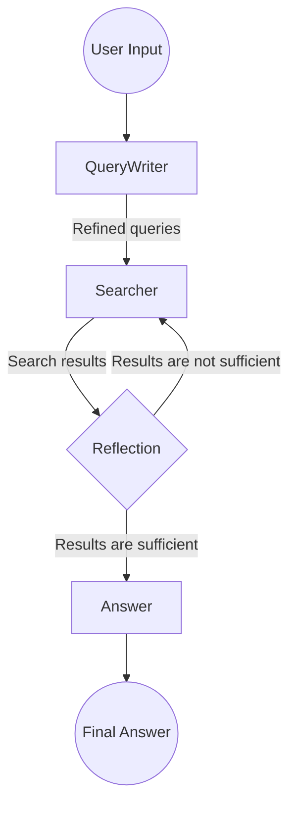

# 🧠 NeuronMind

**NeuronMind** is a fully working example that demonstrates how to build an **agentic AI assistant in PHP**, powered by [Neuron-AI](https://github.com/inspector-apm/neuron-ai), the open-source PHP framework for building LLM-based agents.

> ⚠️ This is not a production-ready product, but an **exploratory project** to showcase how to structure intelligent agent workflows using tools, reasoning, and web search — entirely in PHP.

The architecture is inspired by [Google's gemini-fullstack-langgraph-quickstart](https://github.com/google-gemini/gemini-fullstack-langgraph-quickstart), and reimagined using [Neuron-AI](https://github.com/inspector-apm/neuron-ai).

---

## 🚀 Why Neuron-AI?

**Neuron-AI** brings agentic reasoning, tool calling, chat history, RAG, and integration with LLM providers (OpenAI, Ollama...) — all in native PHP.

This project shows:

- How to build a tool-augmented conversational assistant
- How to decide when to search or answer
- How to compose reasoning steps using graph nodes
- How to stay fully in PHP with no external runtimes

---

## 🧩 Workflow

This project defines a **search tool** using a graph-based reasoning workflow.




When a user asks a question, the system first hands it to the **QueryWriter**, which re-expresses the request as a handful of sharply focused web-search queries. Those queries go to the **Searcher**, which calls Jina’s API and retrieves a set of relevant results—titles, snippets, and links. Next, the **Reflection** reviews this evidence to decide whether it fully answers the user’s question. If gaps remain, it refines or adds queries and loops back through the **Searcher** until the material feels complete. Only then does the **Answer** weave the vetted information into a clear, well-sourced reply that is finally delivered to the user.

---

## 🧠 Features

- ✅ Agent chat powered by `neuron-ai`
- 🔁 Multi-agent reasoning
- 🔍 Web search via Jina
- 🛠️ Tool integration and triggering
- 💬 Small talk handled directly

---

## ⚙️ Requirements

- PHP 8.2+
- Composer
- OpenAI API key
- Jina API key (for search)

---

## 🛠️ Installation

```bash
git clone https://github.com/asterixcapri/neuron-mind.git
cd neuron-mind
docker compose up -d
./docker/shell.sh
composer install
# Add your OPENAI_API_KEY and JINA_API_KEY to .env
```

---

## ▶️ Start Chatting

```bash
php bin/console.php chat
```

Example:

```text
php@c1c36fd26e1b:/app$ ./bin/console.php chat
NeuronMind CLI - type 'exit' to quit
You> hello
NeuronMind> Hello! How can I assist you today?
You> tell me the story of the discovery of the cosmic microwave background radiation, from the earliest theories to the latest findings
QueryWriterNode - Starting...
QueryWriterNode - Question: the story of the discovery of the cosmic microwave background radiation, from the earliest theories to the latest findings
QueryWriterNode - Response: {"rationale":"The user's question involves multiple distinct aspects: the historical development of the cosmic microwave background (CMB) radiation theory, the actual discovery and early evidence of CMB, and the latest findings related to CMB. To comprehensively address the question, three focused queries are necessary, each targeting one major phase of the topic.","queries":["history of cosmic microwave background radiation theories","discovery of cosmic microwave background radiation 1960s","latest findings on cosmic microwave background radiation 2025-06-18"]}
SearcherNode - Starting...
SearcherNode - Query: history of cosmic microwave background radiation theories
SearcherNode - Result: History of Cosmic Microwave Background (CMB) Radiation Theories 1. Early Theoretical Predictions (1948) - The concept of Cosmic Microwave Background radiation w...
SearcherNode - Query: discovery of cosmic microwave background radiation 1960s
SearcherNode - Result: Discovery of Cosmic Microwave Background Radiation in the 1960s 1. The accidental discovery of the Cosmic Microwave Background (CMB) radiation occurred in 1964...
SearcherNode - Query: latest findings on cosmic microwave background radiation 2025-06-18
SearcherNode - Result: Latest Findings on Cosmic Microwave Background Radiation (CMB) as of June 18, 2025 1. High-Definition Images of the Early Universe - In March 2025, new high-def...
ReflectionNode - Starting...
ReflectionNode - Question: the story of the discovery of the cosmic microwave background radiation, from the earliest theories to the latest findings
ReflectionNode - Results: 3
ReflectionNode - Response: {"isSufficient":true,"knowledgeGap":"","followUpQueries":[]}
AnswerNode - Starting...
AnswerNode - Question: the story of the discovery of the cosmic microwave background radiation, from the earliest theories to the latest findings
AnswerNode - Response: The story of the discovery of Cosmic Microwave Background (CMB) radiation traces a fascinating path from theoretical prediction to revolutionary empirical findi...
NeuronMind> The story of the discovery of Cosmic Microwave Background (CMB) radiation traces a fascinating path from theoretical prediction to revolutionary empirical findings and current advanced research.

**Early Theoretical Predictions (1948):**  
The concept of CMB radiation was first theoretically proposed by George Gamow, Ralph Alpher, and Robert Herman in 1948. They predicted that the early hot and dense universe, envisioned in the Big Bang theory, would leave behind faint residual radiation permeating space. This radiation, a leftover glow from the epoch about 380,000 years after the Big Bang when electrons and protons combined into neutral atoms (making the universe transparent), was expected to appear as a uniform background microwave signal. However, these early ideas received little attention initially and remained largely theoretical for over a decade [CERN PDF lecture](https://indico.cern.ch/event/618499/contributions/2573126/attachments/1509128/2352660/lecture_on_CMB_theory_and_history.pdf); [ESA](https://www.esa.int/Science_Exploration/Space_Science/Cosmic_Microwave_Background_CMB_radiation).

**Discovery of the CMB (1964-1965):**  
The CMB was discovered accidentally in 1964 by Arno Allan Penzias and Robert Woodrow Wilson at Bell Labs, New Jersey. Using a horn antenna initially built for satellite communication studies, they detected a persistent, isotropic microwave noise at a wavelength of about 7.35 cm, coming uniformly from all directions in the sky. After eliminating possible sources such as instrumental errors and terrestrial interference (famously including pigeon droppings in the antenna), they realized this was a cosmic signal. Their discovery matched exactly the predictions of the Big Bang theory’s leftover thermal radiation and dealt a decisive blow to rival theories like the steady state model. This finding, published in 1965, was a pivotal moment in cosmology and later earned Penzias and Wilson the Nobel Prize in Physics in 1978 [Wikipedia discovery article](https://en.wikipedia.org/wiki/Discovery_of_cosmic_microwave_background_radiation); [PBS](https://www.pbs.org/wgbh/aso/databank/entries/dp65co.html); [Space.com](https://www.space.com/25945-cosmic-microwave-background-discovery-50th-anniversary.html).

**Subsequent Research and Refinements:**  
Following the discovery, extensive theoretical and experimental efforts refined our understanding of the CMB. Satellites such as COBE, WMAP, and Planck have mapped the tiny temperature fluctuations (anisotropies) in the CMB with increasing precision. These anisotropies correspond to density variations in the early universe, seeds of galaxy and large-scale structure formation, and provide detailed information on the universe’s geometry, composition (including dark matter and dark energy), and evolution. The CMB has become a cornerstone of modern cosmology, validating the Big Bang model and constraining fundamental cosmological parameters [ESA](https://www.esa.int/Science_Exploration/Space_Science/Cosmic_Microwave_Background_CMB_radiation); [Harvard CfA](https://www.cfa.harvard.edu/research/topic/cosmic-microwave-background).

**Latest Findings as of 2025:**  
Recent advances have delivered unprecedented high-definition images of the CMB from collaborations like the Atacama Cosmology Telescope. These images offer the clearest, most precise view yet of the universe at 380,000 years old, revealing intricate structures of the primordial density fluctuations that eventually formed galaxies and clusters. New CMB data strongly support the standard Lambda Cold Dark Matter cosmology, ruling out many alternative early-universe theories [Princeton News](https://www.princeton.edu/news/2025/03/18/new-high-definition-images-released-baby-universe); [Penn Today](https://penntoday.upenn.edu/news/atacama-cosmological-telescope-collaboration-devlin).

Intriguingly, some recent studies (June 2025) suggest that the overall strength (intensity) of the CMB radiation may have been overestimated in past measurements, which could have implications on key cosmological constants and Big Bang interpretations—though these findings remain under debate within the scientific community [SciTechDaily](https://scitechdaily.com/rewriting-cosmology-new-calculations-shake-foundations-of-the-big-bang-theory).

Research is also exploring the CMB’s sensitivity to "dark radiation," hypothetical light particles beyond the Standard Model of particle physics, potentially revealing hidden components of the universe’s dark sector [University of Washington event](https://phys.washington.edu/events/2025-06-03/how-cosmic-microwave-background-knows-about-dark-radiation).

There are also controversial claims emerging that question the exclusive Big Bang origin of the CMB, inspired by new data from the James Webb Space Telescope. These alternative interpretations are still speculative and require more evidence and peer review [YouTube video](https://www.youtube.com/watch?v=p8gOU_5KBqI).

---

**Summary:**  
- In 1948, the CMB was predicted theoretically as a relic radiation from the Big Bang, but it was not observed until Penzias and Wilson serendipitously discovered it in 1964.  
- This discovery provided compelling empirical validation for the Big Bang theory.  
- Subsequent satellite missions refined our knowledge, mapping the CMB’s minute fluctuations and shaping the modern cosmological model.  
- The latest 2025 research has provided the sharpest views yet, reinforced the standard cosmological framework, and opened new questions about the intensity and possible new physics suggested by the CMB.  
- Although some controversial claims exist, the CMB remains a fundamental pillar of our understanding of the universe’s earliest moments.

For detailed reading and references, see:  
- ESA on CMB: https://www.esa.int/Science_Exploration/Space_Science/Cosmic_Microwave_Background_CMB_radiation  
- Wikipedia on Discovery: https://en.wikipedia.org/wiki/Discovery_of_cosmic_microwave_background_radiation  
- CERN Lecture: https://indico.cern.ch/event/618499/contributions/2573126/attachments/1509128/2352660/lecture_on_CMB_theory_and_history.pdf  
- Princeton News (2025 images): https://www.princeton.edu/news/2025/03/18/new-high-definition-images-released-baby-universe  
- SciTechDaily (new calculations): https://scitechdaily.com/rewriting-cosmology-new-calculations-shake-foundations-of-the-big-bang-theory  
- University of Washington event: https://phys.washington.edu/events/2025-06-03/how-cosmic-microwave-background-knows-about-dark-radiation  
- YouTube controversial claims: https://www.youtube.com/watch?v=p8gOU_5KBqI
You> very helpful, thanks
NeuronMind> You're very welcome! If you have any more questions or need further assistance, feel free to ask. Have a great day!
You> exit
```

NeuronMind will rewrite the query, perform a web search, reflect, and generate a detailed answer.

---

## 🧱 Built With

- [Neuron-AI](https://github.com/inspector-apm/neuron-ai) – Agent framework in PHP
- [OpenAI](https://openai.com) – LLM
- [Jina AI](https://jina.ai) – Web search API

---

## 🧠 Inspiration

This project is heavily inspired by:

**[🌐 gemini-fullstack-langgraph-quickstart](https://github.com/google-gemini/gemini-fullstack-langgraph-quickstart)**  
Implemented from scratch in **pure PHP** using Neuron-AI tools.

---

## ⚖️ License

Distributed under the [MIT license](LICENSE).

---

Developed by [Alessandro Astarita](https://github.com/asterixcapri)
